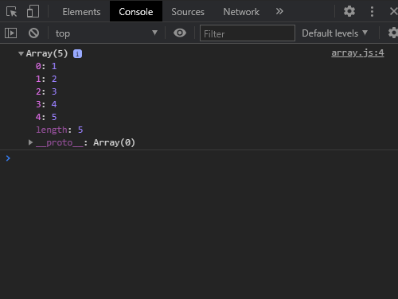
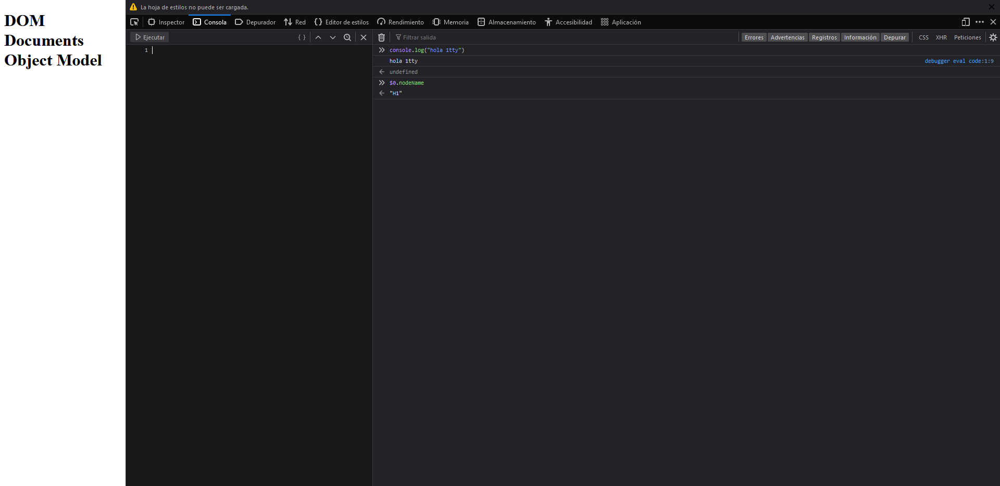

<h2 align="center"> JavaScript-Course - From Zero to Advanced</h2>

<p align="center">
  
  <p align="center">
  
   </a>
    
  </a>
  <a href="https://github.com/BrianMarquez3/JavaScript-Course/stargazers">
    
  </a>
  <a href="https://github.com/BrianMarquez3/JavaScript-Course/network">
    
  </a>
    
  </a>
  
  </a>
    
  </a>
  
  </a>
    
  </a>
  
   </a>
   <a href="https://github.com/BrianMarquez3/JavaScript-Course/network">
    
  </a><br>
 
  
  

<table align="center">
  <tr>
    <td align="center" style="padding=0;width=50%;">
      
    </td>
  </tr>
</table>
   
## Instalación

📦 [Install Visual studio Code](https://code.visualstudio.com/) Intalador de Visual Studio Code <br>
📦 [Install Node.js](https://nodejs.org/es/download/) Instalador de Node.<br>
📦 [Install IntelliJ IDEA](https://www.jetbrains.com/es-es/idea/download/#section=windows) Intalador IntelliJ IDEA.<br>
📦 [Install Prepros](https://prepros.io/) Intalador de Prepros.<br>

## HackerRank Javascript Certificate

<a href="Skills%20Certification/Certified%20JavaScript%20Basic.png">
      
</a>


## Tabla de contenidos

| Numeration   | Check  |Topic          | Quantization   |     link          |
| ------------ |--------|-------------- |--------------- |------------------ |
|  A    |:heavy_check_mark: | [Que es JAVASCRIPT](#Que-es-JAVASCRIPT)   |  :hourglass:    | [ ⬅️ Atras](https://github.com/BrianMarquez3) | 
|  B    |:heavy_check_mark: | [Brendan Eich](#Brendan-Eich)  |  :hourglass:    | [ ⬅️ Atras](https://github.com/BrianMarquez3) | 
|  C    |:heavy_check_mark: | [Historia de JavaScript](#Historia-de-JavaScript)  |  :hourglass:    | [ ⬅️ Atras](https://github.com/BrianMarquez3) | 
|  D    |:heavy_check_mark: | [Como y donde escribir JavaScripts](#Como-y-donde-escribir-JavaScripts)  |  :hourglass:    | [ ⬅️ Atras](https://github.com/BrianMarquez3) | 
|  E    |:heavy_check_mark: | [Sintaxis de JavaScritp](#Sintaxis-de-JavaScritp)   |  :hourglass:    | [ ⬅️ Atras](https://github.com/BrianMarquez3) | 
|  F    |:heavy_check_mark: | [Variables, constantes y sus Ambitos](#Variables-constantes-y-sus-Ambitos)  |  :hourglass:    | [ ⬅️ Atras](https://github.com/BrianMarquez3) | 
|  G    |:heavy_check_mark: | [Declaracion Inializacion y Modificacion](#Declaracion-Inializacion-y-Modificacion)   |  :hourglass:    | [ ⬅️ Atras](https://github.com/BrianMarquez3) | 
| 001   |:heavy_check_mark: | [Tipos de datos en javaScript](#Tipos-de-datos-en-javaScript)   |  :hourglass:    | [ ⬅️ Atras](https://github.com/BrianMarquez3) | 
| 002   |:heavy_check_mark: | [Tipos de Operadores](#Tipos-de-Operadores)  |  :hourglass:    | [ ⬅️ Atras](https://github.com/BrianMarquez3) | 
| 003   |:heavy_check_mark: | [Strings](#Strings)   |  :hourglass:    | [ ⬅️ Atras](https://github.com/BrianMarquez3) | 
| 004   |:heavy_check_mark: | [Objetos Math](#Objetos-Math)  | :hourglass:    | [ ⬅️ Atras](https://github.com/BrianMarquez3) | 
| 005   |:heavy_check_mark: | [Condicionales](#Condicionales)   | :hourglass:    | [ ⬅️ Atras](https://github.com/BrianMarquez3) | 
| 006   |:heavy_check_mark: | [Operadores Logicos](#Operadores-Logicos)   | :hourglass:    | [ ⬅️ Atras](https://github.com/BrianMarquez3) | 
| 007   |:heavy_check_mark: | [Condicinal Switch](#Condicinal-Switch)   | :hourglass:    | [ ⬅️ Atras](https://github.com/BrianMarquez3) | 
| 008   |:heavy_check_mark: | [Ordenar 3 numero de mayor a menor](#008-ordenar-3-numero-de-mayor-a-menoro)   |:hourglass:    | [ ⬅️ Atras](https://github.com/BrianMarquez3) | 
| 009   |:heavy_check_mark: | [Operador Ternario](#operador-ternario)   |:hourglass:    | [ ⬅️ Atras](https://github.com/BrianMarquez3) | 
| 010   |:heavy_check_mark: | [Array](#array)   |:hourglass:    | [ ⬅️ Atras](https://github.com/BrianMarquez3) | 
| 011   |:heavy_check_mark: | [Arrays II](#Arrays-II)  |  :hourglass:    | [ ⬅️ Atras](https://github.com/BrianMarquez3) | 
| 012   |:heavy_check_mark: | [Bucles](#Bucles) |  :hourglass:    | [ ⬅️ Atras](https://github.com/BrianMarquez3) | 
| 013   |:heavy_check_mark: | [Bucle for](#Bucle-for) |  :hourglass:    | [ ⬅️ Atras](https://github.com/BrianMarquez3) | 
| 014   |:heavy_check_mark: | [Bucle for of](#Bucle-for-of) |  :hourglass:    | [ ⬅️ Atras](https://github.com/BrianMarquez3) | 
| 015   |:heavy_check_mark: | [Objetos](#Objetos) |  :hourglass:    | [ ⬅️ Atras](https://github.com/BrianMarquez3) |
| 016   |:heavy_check_mark: | [Funciones](#Funciones) |  :hourglass:    | [ ⬅️ Atras](https://github.com/BrianMarquez3) | 
| 017   |:heavy_check_mark: | [POO](#POO) |  :hourglass:    | [ ⬅️ Atras](https://github.com/BrianMarquez3) | 
| 018   |:heavy_check_mark: | [Metodos de los Arrays](#Metodos-de-los-Arrays) |  :hourglass:    | [ ⬅️ Atras](https://github.com/BrianMarquez3) |
| 019   |:heavy_check_mark: | [Metodos de los Arrays](#Spread-operator) |  :hourglass:    | [ ⬅️ Atras](https://github.com/BrianMarquez3) | 
| 020   |:heavy_check_mark: | [DOM](#DOM) |  :hourglass:    | [ ⬅️ Atras](https://github.com/BrianMarquez3) | 
| 021   |:heavy_check_mark: | [Seleccion de Elementos](#Seleccion-de-Elementos) |  :hourglass:    | [ ⬅️ Atras](https://github.com/BrianMarquez3) | 
| 022   |:heavy_check_mark: | [Atributos y Clases](#Atributos-y-Clases) |  :hourglass:    | [ ⬅️ Atras](https://github.com/BrianMarquez3) | 
| 023   |:heavy_check_mark: | [Eventos raton teclado](#Eventos-raton-teclado) |  :hourglass:    | [ ⬅️ Atras](https://github.com/BrianMarquez3) | 


---


## Que es JAVASCRIPT

- JavaScript es un lenguaje de Programacion.
- Lo creó Brendan Eich en una semana.
- Es el Unico Lenguaje de programacion que puede interpretar el navegador.
- El nombre se le puso por que en ese momento esta de moda java.
- JavaScript ha sido mal visto desde su inicio hasta el 2009 aproximadamente.

## Brendan Eich


es un programador estadounidense conocido por inventar el lenguaje de programación JavaScript.

Brendan Eich recibió su Bachiller en matemáticas y ciencias de la computación en la Universidad de Santa Clara. Recibió su maestría en 1986 de la Universidad de Illinois en Urbana-Champaign. [WIKIPEDIA](https://es.wikipedia.org/wiki/Brendan_Eich).<br>

---
## Historia de JavaScript 

 - 1995 - Netscape crea JavaScript
 - 1997 - Netscape se lleva JavaScript a ECMA (European Computer Manufactures 
 Assiciation)
 - 1997 - Se lanza el estadar ECMA-262 y se crea ECMASscript 1.0
 - 1998 - exmaScript 2 - Ajuste con el estandar Internacional.
 - 1999 - ECMAScript 3
 - 2009 - ECMAScript 5
 - 2011 - ECMAScript 5.1
 - 2015 - ECMAScript 6
 ---

* Tecnologias Descendientes de JavaScrip

Tecnologias Independiente:
- Ajax
- jQuery
- nodeJS
- JSON

---
* Framworks

- Angular
- React
- VueJs

---
## Como y donde escribir JavaScripts

- La Consola del Navegador directamente
- Instalar Node.js
- Atom
- Visual Studio Code
- Brackets
- Notepad++
- Bloc de Notas

---
## Sintaxis de JavaScritp

- Es case senstive.
  Numero no es igual a numero.

- Es tipado de debil o dinamico
  Las variables son de tipo del dato que almacenen.

- La sentencia dinalizan con ;
  No es obligatorio pero es muy reocmendable

- Los Bloques finalizan con }
  de forma opcional se puede anadir un ; despues de }

---
## Variables constantes y sus Ambitos 

- Una Variable es un espacio que reservamos en memoria para almacenar un dato que podra cambiar durante la ejecucion de nuestro programa.

- La Palabra reservada para declarar variables es <strong>let</strong> no es recomendable usar <strong>var</strong>

- Las Variables se puedem: declarar, inicializar y modificar

- Las constante es un espacio re reservamos en memori para alamecer un dato que no cambiará durante la ejecucion de nuestro programa

    *La Palabra reservada para declarar constantes es "const"

  - scape o ambito es la sona donde exite nuestra variable o constante

---  
## Declaracion Inializacion y Modificacion

- Una variable se declara con la siguiente estructura:

    ```js
    let numero;
    ```

- Una variable se inicializa con la siguiente estructura:

    ```js
    numero = 5;
    ```

- se puede declarar e iniciar en la misma sentencia:

    ```js
    let numero 5;
    ```

- para modificar el valro de una variable existe:

    ```js
    numero = 3;
    ```

---
## Tipos de datos en JavaScript

- Primitivos
  - <strong> Numero </strong> -> let numro = 5;
  - <strong> Strings(cadenas) </strong> -> let palabra = "Hola; | let palabra = "Hola;
  - <strong> Boolean </strong> -> respuesta = true; | let respuesta = false;
  - <strong> Undefined </strong>
  - <strong> Null</strong>
  - <strong> Symbol </strong>

|Number | Carpeta      | Link        |    Code     | Version     | Estado      | Atras       |
|-------|--------------|:-----------:|:-----------:|:-----------:|:-----------:|:-----------:| 
|000    |[Variables](https://github.com/BrianMarquez3/JavaScript-Course/tree/main/000%20Variables) |      :heavy_check_mark:      | yes | yes | yes |  :heavy_check_mark:  |⬅️ [Atras](#Tabla-de-contenidos) |


|Number | Carpeta      | Link        |    Code     | Version     | Estado      | Atras       |
|-------|--------------|:-----------:|:-----------:|:-----------:|:-----------:|:-----------:| 
|001    |[Variables](https://github.com/BrianMarquez3/JavaScript-Course/tree/main/000%20Variables) |      :heavy_check_mark:      | yes | yes | yes |  :heavy_check_mark:  |⬅️ [Atras](#Tabla-de-contenidos) |

---

## Tipos de Operadores

Tipos de operadores
En JavaScript encontramos cinco tipos de operadores:

    Aritméticos
    Lógicos
    De comparación
    Binarios
    De asignación
    Otros 

Operadores aritméticos

```js
    Suma (+). Suma dos números: 3 + 2 = 5 .
```

```js
    Resta (-). Halla la diferencia entre dos números.
```
```js
    Negativo (-). Indica el signo negativo de un número o una expresión: -3.
```
```js
    División (/). Divide dos números, obteniendo un cociente de coma flotante: 5 / 2 = 2.5 . 
```
```js
    Módulo aritmético %. Divide dos números, obteniendo un resto entero: 5 % 2 = 1 .
```
```js
    Multiplicación (*). Multiplica dos números: 3 * 2 = 6 .
```

## Asignacion

<table style="text-align:center;" class="asignacion" >
  <tr>
    <td colspan="3">asignacion</td>
  </tr>
      <tr>
        <td>Asignacion</td>
        <td> = </td>
      </tr>
      <tr>
        <td>Suma y Asignacion</td>
        <td>a +=3(a=a+3)</td>
      </tr>
     <tr>
        <td>Resta y Asignacion</td>
        <td>a -=3(a=a-3)</td>
      </tr>
     <tr>
        <td>Multiplicacion y Asignacion</td>
        <td>a *=3(a=a*3)</td>
      </tr>
     <tr>
        <td>Multiplicacion y Asignacion</td>
        <td>a /=3(a=a/3)</td>
      </tr>
     <tr>
        <td>Modulo y Asignacion</td>
        <td>a %=3(a=a%3)</td>
      </tr>
</table>

## Incremento / Decremento

<table style="text-align:center;" class="asignacion" >
  <tr>
    <td colspan="3">Incremento / Decremento</td>
  </tr>
      <tr>
        <td>Post-incremento</td>
        <td> a++ </td>
      </tr>
      <tr>
        <td>Pre-incremento</td>
        <td> ++a </td>
      </tr>
     <tr>
        <td>Post-decremento</td>
        <td>a a-- </td>
      </tr>
     <tr>
        <td>Pre-decremento</td>
        <td> --a </td>
      </tr>
     
</table>


|Number | Carpeta      | Link        |    Code     | Version     | Estado      | Atras       |
|-------|--------------|:-----------:|:-----------:|:-----------:|:-----------:|:-----------:| 
|002    |[Tipo de Operadores](https://github.com/BrianMarquez3/JavaScript-Course/tree/main/002%20Tipo_de_Operadores) |      :heavy_check_mark:      | yes | yes | yes |  :heavy_check_mark:  |⬅️ [Atras](#Tabla-de-contenidos) |

---
## Strings

### Metodos y propiedades de los String

- METODO : es aquello que la cadenas pueder ejercer, Ej: Covertirse en mayúslas
- PROPIEDAD: son las caracteristicas que la cadena tiene por ser cadena: Ej: Longitud <br>
  
se emplean usando la nomeclatura del punto: <br>
    cadenas.metodo <br>
    cadena.propiedad <br>

### Ejemplos 

[W3School JavaScripts](https://www.w3schools.com/js/js_strings.asp)
    


|Number | Carpeta      | Link        |    Code     | Version     | Estado      | Atras       |
|-------|--------------|:-----------:|:-----------:|:-----------:|:-----------:|:-----------:| 
|003    | [Strings](https://github.com/BrianMarquez3/JavaScript-Course/tree/main/003%20Strings) |      :heavy_check_mark:      | yes | yes | yes |  :heavy_check_mark:  |⬅️ [Atras](#Tabla-de-contenidos) |


---

## Objetos Math


* E sun objeto que se utiliza para operaciones matematicas mas especificas
* Al ser un objeto tamien utliza la nomenclatura del punto

### Propiedades:
    * Math.E - Math.Pi

Metodos: <br>

```JS
    - Math.abs(x) : Devuelve el valor absoluto de x <br>
    - Math.ceil(x) : Devuelve el entero mas grande mayor o igual que un numero. <br>
    - Math.floor(x) : Devuelve el entero mas pequeño menor o igual que un numero. <br>
    - Math.pow (x,y) : Devuelve la potencia de x elevado a y <br>
    - Math.randon() : Genera un numero psucoaleatorio entre 0 y 1 <br>
    - Math.raound(x) : Devuelve el valor de un numero redondeado al entero mas cercano. <br>
    - Math.sign(x) : Devuelve el signo de la x, que indica si x es posotovo , negativo o cero. <br>
```
    

|Number | Carpeta      | Link        |    Code     | Version     | Estado      | Atras       |
|-------|--------------|:-----------:|:-----------:|:-----------:|:-----------:|:-----------:| 
|004    | [Objetos Math](https://github.com/BrianMarquez3/JavaScript-Course/tree/main/004%20Objeto_Math) |      :heavy_check_mark:      | yes | yes | yes |  :heavy_check_mark:  |⬅️ [Atras](#Tabla-de-contenidos) |

---
## Condicionales


_Estructuras de control de flujo:_

    - Condicionales
        Simples
        Compuestos
        Multiples

    - Bucles
        Determinados
        Indeterminados

### Sintaxis

-   Sintaxis Simple:
    <br>
    ```js
    if(condicion){
    //Codigo
    }
    ```

-   Sintaxis Compuesto:
    <br>
    ```js
    if(condicion){
    //Codigo
    }else{
    //codigo
    }
    ```
    
|Number | File         | Link        |  Code       | Version     | Estado      | Atras       |
|-------|--------------|:-----------:|:-----------:|:-----------:|:-----------:|:-----------:|  
|005    | [Condicionales](https://github.com/BrianMarquez3/JavaScript-Course/tree/main/005%20Condicionales) |   |      :heavy_check_mark:      | yes | yes | yes |  :heavy_check_mark:  |⬅️ [Atras](#Tabla-de-contenidos)|
    
---

## Operadores Logicos

|Number  | File         | Link        |  Code       | Version     | Estado      | Atras       |
|--------|--------------|:-----------:|:-----------:|:-----------:|:-----------:|:-----------:|  
|006     | [operadores Logico](https://github.com/BrianMarquez3/JavaScript-Course/tree/main/006%20operadores_Logicos) |      :heavy_check_mark:      | yes | yes | yes |  :heavy_check_mark:  |⬅️ [Atras](#Tabla-de-contenidos)|


---

## Condicinal Switch

- Se utiiza para elegir un camino de varios prestablecdos:

```js
switch (expresión) {
  case valor1:
    //Declaraciones ejecutadas cuando el resultado de expresión coincide con el valor1
    [break;]
  case valor2:
    //Declaraciones ejecutadas cuando el resultado de expresión coincide con el valor2
    [break;]
  ...
  case valorN:
    //Declaraciones ejecutadas cuando el resultado de expresión coincide con valorN
    [break;]
  default:
    //Declaraciones ejecutadas cuando ninguno de los valores coincide con el valor de la expresión
    [break;]
}
```

|Number |   File       | Link        |  Code       | Version     | Estado      | Atras       |
|-------|--------------|:-----------:|:-----------:|:-----------:|:-----------:|:-----------:|  
|007    | [Condicional Swich](https://github.com/BrianMarquez3/JavaScript-Course/tree/main/007%20Condicional%20Swich) |     heavy_check_mark:      | yes | yes | yes |  :heavy_check_mark:  |⬅️ [Atras](#Tabla-de-contenidos) |

---
## Ordenar 3 numero de mayor a menor

|Number  | File         | Link        |     Code    | Version     | Estado      | Atras       |
|--------|--------------|:-----------:|:-----------:|:-----------:|:-----------:|:-----------:|  
|008     | [Ordenar 3 numero de mayor a menor](https://github.com/BrianMarquez3/JavaScript-Course/tree/main/008%20ordenar%203%20numero%20de%20mayor%20a%20menor) |     :heavy_check_mark:      | yes | yes | yes |  :heavy_check_mark:  | ⬅️ [Atras](#Tabla-de-contenidos) |

---

## Operador Ternario

- Se utliza cuando una condicion serña TRUE O FALSE , al igual que el if.
- Su ejecucion puede tener una o varias sentenciasm en este caso iran separadas por comas y entre parentesis.

### Sintaxis
* Una sentencia

```js
(condicion)? true:false
```

* Varias Sentencias

```js
(condicion)? 
    (primera_sentenca,
    segunda_sentencia)
```

|Number | Carpeta       | Link        |  Code       | Version     | Estado      |Atras        |
|-------|--------------|:-----------:|:-----------:|:-----------:|:-----------:|:-----------:|  
|009    | [Operador Ternario](https://github.com/BrianMarquez3/JavaScript-Course/tree/main/009%20operador%20ternario) |      :heavy_check_mark:      | yes | yes | yes |  :heavy_check_mark:  |⬅️ [Atras](#Tabla-de-contenidos)  |

---

## Array 

- son estructuras que nos permiten almacenar varios dartos agrupados
- se pueden llenar con cualquier tipo de dato valido en javascript y deben ir separados por comas
- se puden mezclar tipos de datos, pero no es recomendable
- se declaran con llaves cuadradas o corchetes
- Puweden declararse vacios o con un conetenido ya establecido
- Pueden añadirse  o eliminarse elementos en el momento que quedramos

### Sintaxis

```js
let array =[]
let array = [1,2,3,4,5,]
```

<table align="center">
  <tr>
    <td align="center" style="padding=0;width=50%;">
      
    </td>
  </tr>
</table>
   

|Number | File         | Link        |  Code       | Version     | Estado      | Atras       |
|-------|--------------|:-----------:|:-----------:|:-----------:|:-----------:|:-----------:|  
|010    | [Array](https://github.com/BrianMarquez3/JavaScript-Course/tree/main/010%20Array) |    :heavy_check_mark:      | yes | yes | yes |  :heavy_check_mark:  | ⬅️ [Atras](#Tabla-de-contenidos)|

---

## Arrays II

|Number | Carpeta      | Link        |     Code    | Version     | Estado      | Atras       |
|-------|--------------|:-----------:|:-----------:|:-----------:|:-----------:|:-----------:|  
|011    | [ArrayII](https://github.com/BrianMarquez3/JavaScript-Course/tree/main/011%20Array%20II) |    :heavy_check_mark:      | yes | yes | yes | ⬅️ [Atras](#Tabla-de-contenidos) |

## Bucles 

- Se usan cuando queremos que un trozo de codigo se repita.

 - Esite buvles determinaso e indeterminados

    * Bucle While:
    Es un bucle indeterminado ya queno sabemos cuantas vueltas dará durante la ejecucion.

    ```js
    while(condicion){

        //codigo a ejecutar
    }
    ```

    * Bucle D While
    Es un buble indeterminado ya que no sabmos cuantas vueltas dará durante la ejecucion

     ```js
    do{

     //codigo a ejecutar
    }while(condicion)

    
    ```

|Bucles | File      | Link        |  Code       | Version     | Estado      | Atras       |
|:-----:|--------------|:-----------:|:-----------:|:-----------:|:-----------:|:-----------:|  
|012    | [Bucles ](https://github.com/BrianMarquez3/JavaScript-Course/tree/main/012%20Bucles) |    :heavy_check_mark:      | yes | yes | yes |⬅️ [Atras](#Tabla-de-contenidos) | 

---

## Bucle for

|Number| Carpeta      | Link        |  Code       | Version     | Estado      | Atras       |
|:----:|--------------|:-----------:|:-----------:|:-----------:|:-----------:|:-----------:|  
|013   | [Bucle for](https://github.com/BrianMarquez3/JavaScript-Course/tree/main/013%20Bucle%20for) |    :heavy_check_mark:      | yes | yes | yes | ⬅️ [Atras](#Tabla-de-contenidos) |

---
## Bucle for of

|Number| File        | Link        |    Code     | Version     | Estado      | Atras  |
|------|:-----------:|:-----------:|:-----------:|:-----------:|:-----------:|:------:|  
|014| [Bucle for of ](https://github.com/BrianMarquez3/JavaScript-Course/tree/main/014%20Bucles%20for%20of) |    :heavy_check_mark:      | yes | yes | yes | ⬅️ [Atras](#Tabla-de-contenidos) |

## Objetos

### Objetos - Introduccion
 
Son estructuras de datos que representan propiedades, valores y acciones que pueden realizar el objeto

Todos lo objetos tienen propiedades o atributos y comportammientos o acciones representados por pares de clave(key)(value)


== Objetos Ejemplo ==

```js
const computer = {
    screensize: 17,
    model:'Macbook Pro'
}
```


```js
const table = {
    material: 'madera',
    width: 160,
    height: 110
}
```
### Acceso al Objeto

para acceder a las propierdades y acciones del objeto se utiliza la nomanclatura del punto

```js
const person = {
    name: 'brian',
    age:'26',
    sons: ['laura', 'diego']
}

console.log(person, name)
console.log(person, age)
console.log(person, sons[0])
console.log(person, sons[1])
```

|Number | Carpeta      | Link        |     Code       | Version     | Estado   | Atras       |
|-------|--------------|:-----------:|:-----------:|:-----------:|:-----------:|:-----------:|  
|015    | [Objetos ](https://github.com/BrianMarquez3/JavaScript-Course/tree/main/015%20Objetos) |    :heavy_check_mark:      | yes | yes | yes | ⬅️ [Atras](#Tabla-de-contenidos) |

---

## Funciones

|Number| File         | Link        |     Code       | Version  | Estado     | Atras        |
|------|--------------|:-----------:|:-----------:|:-----------:|:-----------:|:-----------:|  
|016   | [Funciones](https://github.com/BrianMarquez3/JavaScript-Course/tree/main/016%20Funciones) |    :heavy_check_mark:      | yes | yes | yes | ⬅️ [Atras](#Tabla-de-contenidos) |


## POO

### Programacion Orientada a Objetos

- Es un aparedigma de la programacion que actualiza las forma de programar anterior

- Algunos de lo conceptos fundamentales son:

    - Clase
    - Herencia
    - Objeto
    - Evento

### Con la llegada de EMA Scrip 6

- Se crea un objeto, a esa accion se le denomina INTANCIAR un objeto
- Necesitamos una funcion construcctora. se tiene que llamar constructor y se ejecuta cada ves que creemos un obje
- 

**Ejemplo**

```js
class Persona{ // en no,bre de la clae se coloca con mayuscula
    constructor(nombre, apellido, edad){  // se usa oblidaso constructor
        this.nombre = nombre // hace referencia al objeto que creamos
        this.apellido = apellido
        this.edad = edad
    }
```
### Clases - Metodos

_Los Objetos peuden tener funciones asociadasa él. En ese caso se les denomina METODOS._

- para crear un objeto la clases o plantilla sehace con la palabra reserbada `new` y el nombre de la clase que queremos utilizar

|Number| File         | Link        |    Code     | Version     | Estado      | Atras       |
|------|--------------|:-----------:|:-----------:|:-----------:|:-----------:|:-----------:|  
|017   | [POO ](https://github.com/BrianMarquez3/JavaScript-Course/tree/main/017%20POO%20-%20Clases) |    :heavy_check_mark:      | yes | yes | yes |⬅️ [Atras](#Tabla-de-contenidos)| 


## Metodos de los Arrays

`.from` (iterable) - Conierte en array el elemento iterable <br>
`.sort`(callback) - ordena los elemetos de un array alfabeticamente(valor unicaode)<br>
`.forEach` - ejecuta la funcion indicada una ves por cada elemento array<br>
`.some` (callback) - comprueba si al meno un elemento del array cumple la conducion<br>
`.every`(callback) - comprueba si todos los elementos del array cumplen la condicion<br>
`.map`(callback) - Transforma todos los elelentso del array y devuelve un nuevo array<br>
`.map`(callback) - Transforma todos los elelentso del array y devuelve un nuevo array<br>
`.filter` - trnasoforma todos los elementos del array y devuelven un nuevo array<br>
`.reduce` - Reduce todos los elelentos del array a un unico valor<br>

|Number| File         | Link        |    Code     | Version     | Estado      | Atras       |
|------|--------------|:-----------:|:-----------:|:-----------:|:-----------:|:-----------:|  
|018   | [Metodos de los Arrays ](https://github.com/BrianMarquez3/JavaScript-Course/tree/main/018%20Metodo%20de%20lo%20arrays) |    :heavy_check_mark:      | yes | yes | yes |⬅️ [Atras](#Tabla-de-contenidos)|

## Spread operator

```js
const numbers = [-12, 2, 3, 23, 43, 2, 3]
console.log(...numbers); // se observa numero separados


const addNumbers = (a,b,c,) =>{
    console.log(a+b+c)
}
```

|Number| File         | Link        |   Code       | Version     | Estado     | Atras       |      
|------|--------------|:-----------:|:-----------:|:-----------:|:-----------:|:-----------:|  
|019   | [Spread operator](https://github.com/BrianMarquez3/JavaScript-Course/tree/main/019%20Spread%20operator) |    :heavy_check_mark:      | yes | yes | yes | ⬅️ [Atras](#Tabla-de-contenidos) |

<table align="center">
  <tr>
    <td align="center" style="padding=0;width=50%;">
      
    </td>
  </tr>
</table>

---
## DOM

Es toda la estructura HTML del documento.
No es JavaScript, es una API (Aplication Programing Interface)

```js
<!DOCTYPE html>
<html lang="en">
<head>
    <meta charset="UTF-8">
    <title> DOM </title>
</head>
<body>

    <h1 id="title" class="title"> DOM Documents Object Model</h1>
    
</body>
</html>
```

### Representacion

```powershell

+---DOCUMENT
    +---LANG
    \---HTML
        +---HEAD
        |   +---META
                \---CHARSET
        |   +---TITLE
                \---DOM
        +--- BODY
        |   +---BODY
        |   +---H1
        |       +---ID
        |       +---CLASS
        |       \---TEXT

```

### Nodos

Cada parte del arbol del documento es un NODO

Hay varios tipos de nodos, los mas utilizados son:

    * Element node - 1 (cualuier etiqueta HTML)
    * Text node - 3 (El Contenido de la etiqueta)
    * Comment node - 8 (Culquier comentario en HTML)


<table align="center">
  <tr>
    <td align="center" style="padding=0;width=50%;">
      
    </td>
  </tr>
</table>
   
| Number  |File            | Link        |     Code    | Version     | Estado      | Atras       |
|:-------:|:--------------:|:-----------:|:-----------:|:-----------:|:-----------:|:-----------:|  
|020     | [DOM](https://github.com/BrianMarquez3/JavaScript-Course/blob/main/020%20DOM) |    :heavy_check_mark:      | yes | yes | yes |yes |⬅️ [Atras](#Tabla-de-contenidos)|

## Seleccion de Elementos

| Number  | File         | Link        |  Code       | Version     | Estado      | Atras       |
|:-------:|--------------|:-----------:|:-----------:|:-----------:|:-----------:|:-----------:|  
|021 | [Seleccion de Elementos](https://github.com/BrianMarquez3/JavaScript-Course/tree/main/021%20Seleccion%20de%20Elementos) |    :heavy_check_mark:      | yes | yes | yes | ⬅️ [Atras](#Tabla-de-contenidos) |

## Atributos y Clases

| Number  |File            | Link         |    Code       | Version  | Estado      | Atraz       |
|:-------:|:--------------:|:-----------:|:-----------:|:-----------:|:-----------:|:-----------:|  
|022 | [Atributos y Clases](https://github.com/BrianMarquez3/JavaScript-Course/tree/main/022%20Atributos%20y%20Clases) |    :heavy_check_mark:      | yes | yes |yes| ⬅️ [Atras](#Tabla-de-contenidos) |

## Eventos raton teclado

<table border="1" cellpadding="7" cellspacing="0">
		<tbody>
			<tr style="background-color: rgb(204, 204, 204);">
				<td>
					<p style="text-align: center;">
						<b>Tipo de evento</b></p>
				</td>
				<td>
					<p style="text-align: center;">
						<b>Nombre con prefijo on (eliminar cuando proceda)</b></p>
				</td>
				<td>
					<p style="text-align: center;">
						<b>Descripción aprenderaprogramar.com</b></p>
				</td>
			</tr>
			<tr>
				<td rowspan="10">
					<p>
						<b>Relacionados con el ratón</b></p>
				</td>
				<td>
					<p style="text-align: center;">
						onclick</p>
				</td>
				<td>
					<p>
						Click sobre un elemento</p>
				</td>
			</tr>
			<tr>
				<td>
					<p style="text-align: center;">
						ondblclick</p>
				</td>
				<td>
					<p>
						Doble click sobre un elemento</p>
				</td>
			</tr>
			<tr>
				<td>
					<p style="text-align: center;">
						onmousedown</p>
				</td>
				<td>
					<p>
						Se pulsa un botón del ratón sobre un elemento</p>
				</td>
			</tr>
			<tr>
				<td>
					<p style="text-align: center;">
						onmouseenter</p>
				</td>
				<td>
					<p>
						El puntero del ratón entra en el área de un elemento</p>
				</td>
			</tr>
			<tr>
				<td>
					<p style="text-align: center;">
						onmouseleave</p>
				</td>
				<td>
					<p>
						El puntero del ratón sale del área de un elemento</p>
				</td>
			</tr>
			<tr>
				<td>
					<p style="text-align: center;">
						onmousemove</p>
				</td>
				<td>
					<p>
						El puntero del ratón se está moviendo sobre el área de un elemento</p>
				</td>
			</tr>
			<tr>
				<td>
					<p style="text-align: center;">
						onmouseover</p>
				</td>
				<td>
					<p>
						El puntero del ratón se sitúa encima del área de un elemento</p>
				</td>
			</tr>
			<tr>
				<td>
					<p style="text-align: center;">
						onmouseout</p>
				</td>
				<td>
					<p>
						El puntero del ratón sale fuera del área del elemento o fuera de uno de sus hijos</p>
				</td>
			</tr>
			<tr>
				<td>
					<p style="text-align: center;">
						onmouseup</p>
				</td>
				<td>
					<p>
						Un botón del ratón se libera estando sobre un elemento</p>
				</td>
			</tr>
			<tr>
				<td>
					<p style="text-align: center;">
						contextmenu</p>
				</td>
				<td>
					<p>
						Se pulsa el botón derecho del ratón (antes de que aparezca el menú contextual)</p>
				</td>
			</tr>
			<tr>
				<td rowspan="3">
					<p>
						<b>Relacionados con el teclado</b></p>
				</td>
				<td>
					<p style="text-align: center;">
						onkeydown</p>
				</td>
				<td>
					<p>
						El usuario tiene pulsada una tecla (para elementos de formulario y body)</p>
				</td>
			</tr>
			<tr>
				<td>
					<p style="text-align: center;">
						onkeypress</p>
				</td>
				<td>
					<p>
						El usuario pulsa una tecla (momento justo en que la pulsa) (para elementos de formulario y body)</p>
				</td>
			</tr>
			<tr>
				<td>
					<p style="text-align: center;">
						onkeyup</p>
				</td>
				<td>
					<p>
						El usuario libera una tecla que tenía pulsada (para elementos de formulario y body)</p>
				</td>
			</tr>
			<tr>
				<td rowspan="6">
					<p>
						<b>Relacionados con formularios</b></p>
				</td>
				<td>
					<p style="text-align: center;">
						onfocus</p>
				</td>
				<td>
					<p>
						Un elemento del formulario toma el foco</p>
				</td>
			</tr>
			<tr>
				<td>
					<p style="text-align: center;">
						onblur</p>
				</td>
				<td>
					<p>
						Un elemento del formulario pierde el foco</p>
				</td>
			</tr>
			<tr>
				<td>
					<p style="text-align: center;">
						onchange</p>
				</td>
				<td>
					<p>
						Un elemento del formulario cambia</p>
				</td>
			</tr>
			<tr>
				<td>
					<p style="text-align: center;">
						onselect</p>
				</td>
				<td>
					<p>
						El usuario selecciona el texto de un elemento input o textarea</p>
				</td>
			</tr>
			<tr>
				<td>
					<p style="text-align: center;">
						onsubmit</p>
				</td>
				<td>
					<p>
						Se pulsa el botón de envío del formulario (antes del envío)</p>
				</td>
			</tr>
			<tr>
				<td>
					<p style="text-align: center;">
						onreset</p>
				</td>
				<td>
					<p>
						Se pulsa el botón reset del formulario</p>
				</td>
			</tr>
			<tr>
				<td rowspan="3">
					<p>
						<b>Relacionados con ventanas o frames</b></p>
				</td>
				<td>
					<p style="text-align: center;">
						onload</p>
				</td>
				<td>
					<p>
						Se ha completado la carga de la ventana</p>
				</td>
			</tr>
			<tr>
				<td>
					<p style="text-align: center;">
						onunload</p>
				</td>
				<td>
					<p>
						El usuario ha cerrado la ventana</p>
				</td>
			</tr>
			<tr>
				<td>
					<p style="text-align: center;">
						onresize</p>
				</td>
				<td>
					<p>
						El usuario ha cambiado el tamaño de la ventana</p>
				</td>
			</tr>
			<tr>
				<td>
					<p>
						<b>Relacionados con animaciones y transiciones</b></p>
				</td>
				<td colspan="2">
					<p>
						animationend, animationiteration, animationstart, beginEvent, endEvent, repeatEvent, transitionend</p>
				</td>
			</tr>
			<tr>
				<td>
					<p>
						<b>Relacionados con la batería y carga de la batería</b></p>
				</td>
				<td colspan="2">
					<p>
						chargingchange, chargingtimechange, dischargingtimechange, levelchange</p>
				</td>
			</tr>
			<tr>
				<td>
					<p>
						<b>Relacionados con llamadas tipo telefonía</b></p>
				</td>
				<td colspan="2">
					<p>
						alerting, busy, callschanged, connected, connecting, dialing, disconnected, disconnecting, error, held, holding, incoming, resuming, statechange</p>
				</td>
			</tr>
			<tr>
				<td>
					<p>
						<b>Relacionados con cambios en el DOM</b></p>
				</td>
				<td colspan="2">
					<p>
						DOMAttrModified, DOMCharacterDataModified, DOMContentLoaded, DOMElementNameChanged, DOMNodeInserted, DOMNodeInsertedIntoDocument, DOMNodeRemoved, DOMNodeRemovedFromDocument, DOMSubtreeModified</p>
				</td>
			</tr>
			<tr>
				<td>
					<p>
						<b>Relacionados con arrastre de elementos (drag and drop)</b></p>
				</td>
				<td colspan="2">
					<p>
						drag, dragend, dragenter, dragleave, dragover, dragstart, drop</p>
				</td>
			</tr>
			<tr>
				<td>
					<p>
						<b>Relacionados con video y audio</b></p>
				</td>
				<td colspan="2">
					<p>
						audioprocess, canplay, canplaythrough, durationchange, emptied, ended, ended, loadeddata, loadedmetadata, pause, play, playing, ratechange, seeked, seeking, stalled, suspend, timeupdate, volumechange, waiting, complete</p>
				</td>
			</tr>
			<tr>
				<td>
					<p>
						<b>Relacionados con la conexión a internet</b></p>
				</td>
				<td colspan="2">
					<p>
						disabled, enabled, offline, online, statuschange, connectionInfoUpdate</p>
				</td>
			</tr>
			<tr>
				<td>
					<p>
						<b>Otros tipos de eventos</b></p>
				</td>
				<td colspan="2">
					<p>
						Hay más tipos de eventos: relacionados con la pulsación sobre pantallas, uso de copy and paste (copiar y pegar), impresión con impresoras, etc.</p>
				</td>
			</tr>
		</tbody>
	</table>


| Number  |File          | Link        |  Code       | Version     | Estado      | Atras       |
|:-------:|--------------|:-----------:|:-----------:|:-----------:|:-----------:|:-----------:|  
|023      | [Eventos raton teclado](https://github.com/BrianMarquez3/JavaScript-Course/tree/main/023%20Eventos%20raton%20Teclado) |:heavy_check_mark:|  yes | yes |yes|⬅️ [Atras](#Tabla-de-contenidos) |

---

## Book

<table>
  <tr>
      <td>Name</td>
      <td>Authors</td>
      <td>Edition</td>
      <td>ISBN</td>
      <td>Link</td>
      <td>Password</td>
  </tr>

  <tr>
      <td>Building Front-End Web Apps with Plain JavaScript</td>
      <td>Gerd Wagner</td>
      <td></td>
      <td> </td>
      <td><a href="https://web-engineering.info/tech/JsFrontendApp/book/">Building Front-End Web Apps with Plain JavaScript Online </a></td>
      <td></td>
  </tr>
  
   <tr>
      <td>The javaScript Languaje</td>
      <td>Ilya Kantor</td>
      <td> - </td>
      <td>- </td>
      <td><a href="https://dubox.com/s/1MaEkY8JrRNLxb5HkMt2EoA">The javaScript Languaje </a><a href="https://es.javascript.info/">The javaScript Languaje Manual</a>. </td>
      <td>3un7</td>
  </tr>

</table>

## Paypal
🩸 Hacer una donación [PAYPAL](https://www.paypal.com/donate?hosted_button_id=98U3T62494H9Y) 🍵

---

 <table align="center">
    <tr>
      <td colspan="3">A</td>
        <td>B</td>
      </tr>
      <tr>
        <td>C</td>
      <td colspan="2"></td>
        <td>E</td>
      </tr>
      <tr>
      <td colspan="3">F</td>
        <td>G</td>
    </tr>
</table>


