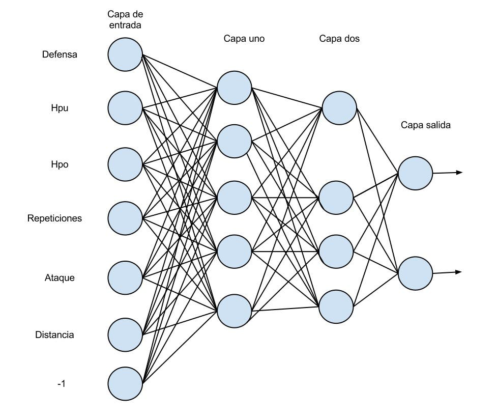
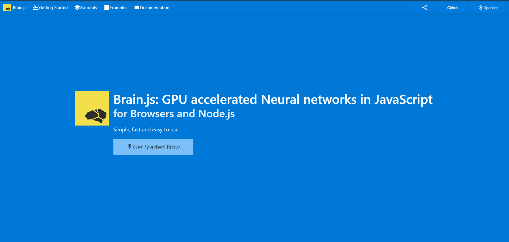

## Redes Neuronales

* Grafico



- Funcion en A.I

```js
function redNeuronal(paraEntrada)
    //procesamiento magico de la red neuronal
    // Logica
    return resultado; // salida
```

## Brain JS



## Resumen
 
 - Se trabajó con Inteligencia Artificial - Aprendisaje Automatico.
 - Se utilizó redes neuronales Artificiales.
 - Se Utilizo una sola capa Oculta.
 - Red reuronal superficial. (Perceptron Multicapa)
 
## Creador

[https://www.youtube.com/watch?v=UNFFLJPW7KQ&t=245s]